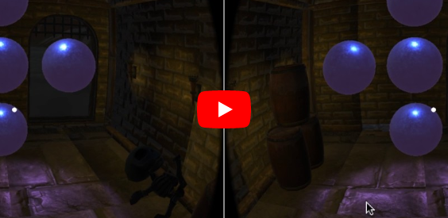
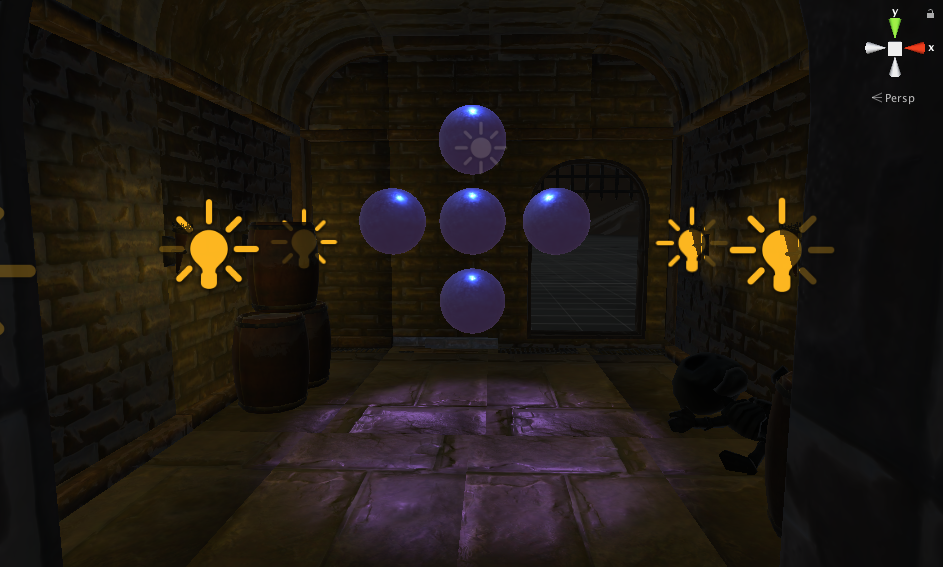
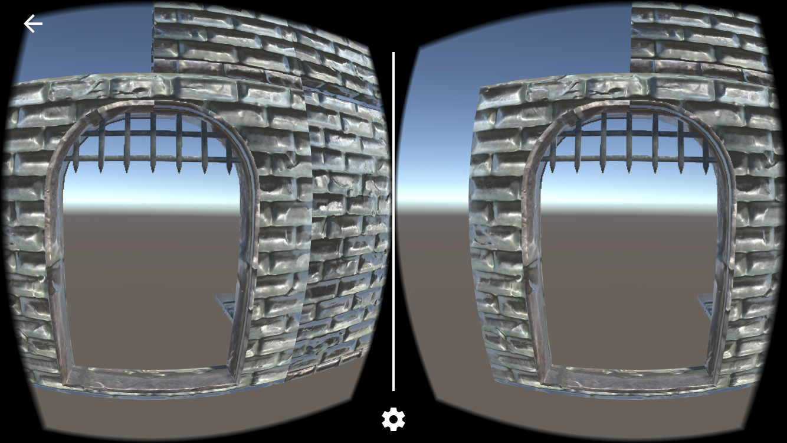
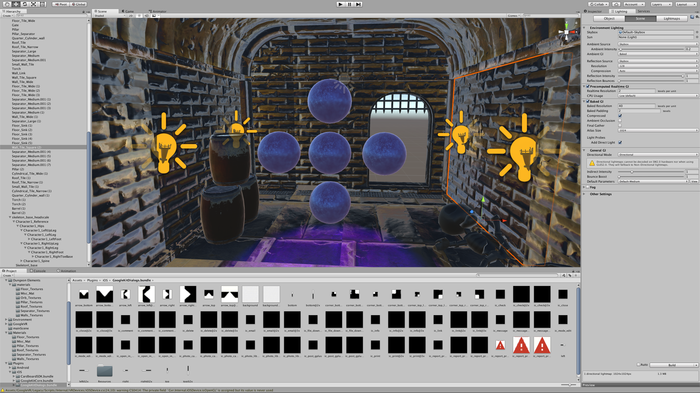
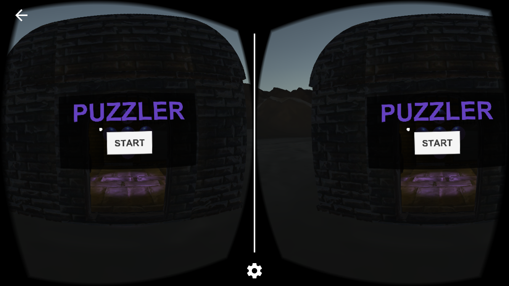
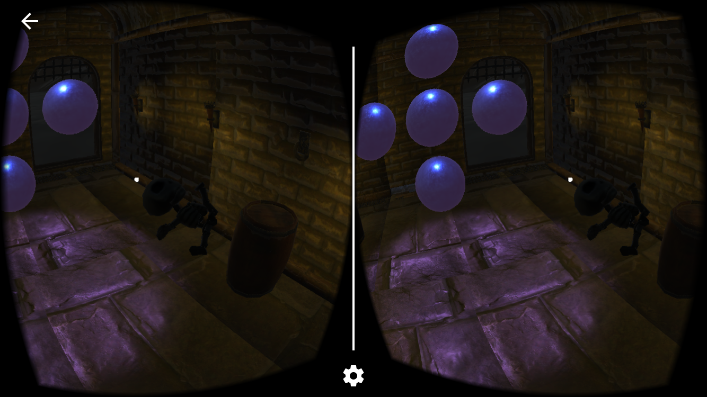
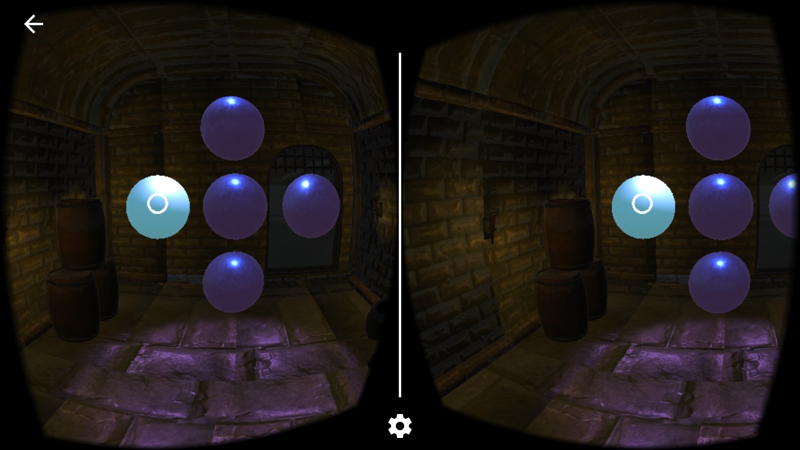
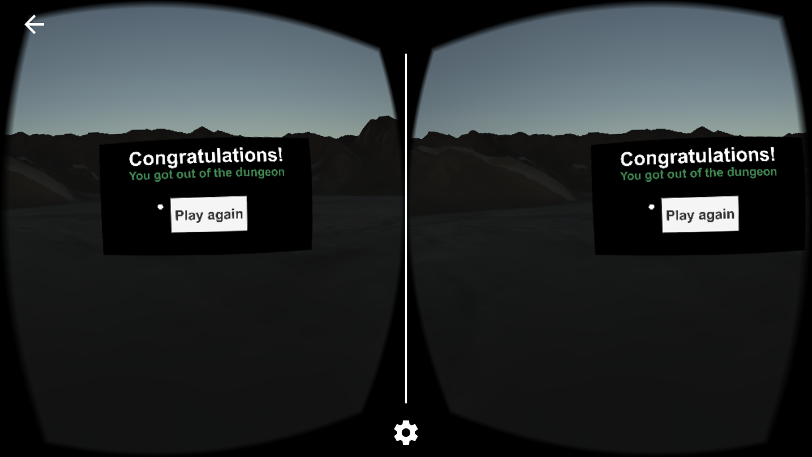

# Puzzler - VR Project (Unity)

Puzzler is a part of Udacity's VR nanodegree. In this project I've learned to design, test and iterate on VR experiences. In the Puzzler game, the players have to solve a Simon Says like puzzle game in order to get out of the scary dungeon.

**Unique considerations**

>The design process was very interesting and I went through many consideration in many aspects. The biggest problem was to find out how to make the players understand what should they do to get out, and to make the VR experience intuitive as much as possible.

## Puzzler

The project is a great success thanks to the people that were always happy to test it and to the developers that went early and often in the iteration process. Each iteration brought me to many new decisions to take and each one made the project a better experience.

# The process

> Statement of purpose: Puzzler is a mobile VR game for people who have never tried VR before, and its meant to make them entertained and play intuitively.

## **Persona**

Noa, 29 — Graphic Designer

*I like gadgets and well designed staff, It'll be interesting to try out VR sometime.*

Noa is a married young mother with two kids, she works a lot and when she get home she is raising her kids with her husband. She like to buy them toys and she is familiar with the toys and computer games on the market. She have seen some low budget VR glasses and games but have never experienced a really good VR experience. AS a graphic designer, nice computer graphics excite her. She is very energetic person and always like to try out new things. Her sight is not so good, she's wearing glasses sometimes which made her think that VR won't be a good experience for her.

> This persona helped to take all the decisions in the design process, I've referenced each issue to Noa and immediately knew the right solution for my game.

***

## Sketches & Ergonomics

After realizing the main goal of the project I started to sketch the main scene. I took into consideration many ergonomics aspects, I placed the main objects in front of the user so he won't search for them and decided to made the movement as slow as possible to prevent sim sickness. In the sketches I drew the start ui, the end ui, the dungeon and the orbs arrangement. That helped me make some very important decisions before starting the project.

***

## Setting the scene

After sketching the scene and having the Udacity's prefabs the rest was easy. First, I decided to make the users a bit claustrophobic so I made the dungeon relatively small and the door short so that the sharp ends will nearly touch the "player's head". Then I've arranged everything in place as was planned in the sketch. I've added some lighting and tried to make the scene scary, to make the users want to solve the puzzle and get out of the dungeon. Finally I've added the UIs in the right places and the game logic, and finally was ready for first user test.

***

## User Testing

The great moment have come and finally I could test the experince I've designed on real people because "they are not like me".. ;).

1. In the first user tests the main response was that the users felt very tall and some of them if felt like they are hovering in the air. So the conclusion was to lower the camera a bit.
2. The second user test made me understand that the mood is not scary. So I made the scene a bit darker and added a skeleton in the scene. Finally I've added the sounds and that made all the difference, now it is a really scary dungeon.
3. In my third and last user test I realized that people that have no VR experience didn't understand that they have to click on the orbs — I fixed it by making another orb material for the hovering and I made it 50% white compared to the default, to make it not fully clicked. The second conclusion was to make the movement linear and fast, because some people who are more sensitive got sim sickness.

***

## Breakdown of Final Piece

***

## Conclusion

This project made me learn the VR design process deeply, I've learned that taking all the design aspects into consideration make the working process more productive and take the project to a higher level — as Benjamin Franklin said " **Failing to plan** is **planning to fail"**. I've learned a lot about user testing and iterating, each iteration and implementation of the user test results made me understand better who am I building the project for and took it to a new level.

## Next Steps

I will keep test the project and maybe add some more levels to the game. Every new feature will be documented and posted here so stay tuned ;)

* **Download it on the app store!**
* Contact me: ilan.kushnir AT gmail.com
* linkedIn: [www.linkedin.com/in/ilan-kushnir/](http://www.linkedin.com/in/ilan-kushnir/)

# Thanks!

* [Virtual Reality](/tag/virtual-reality)
* [Udacity](www.udacity.com)
